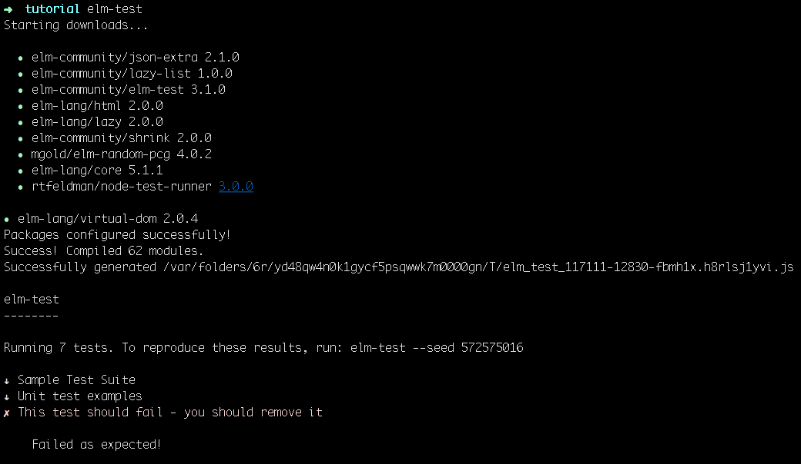

# Elm native module

## What?

This is an example of how to do elm native modules for elm 0.18. It
contains a native module with a `helloWorld` function which receives a
name parameter and returns a string with that name appended to the 'Hello ' string
and an exclamation at the end.

## Why?

There are not too many tutorials about how native modules. One of them
is the wiki of
[take-home](https://github.com/eeue56/take-home/wiki/Writing-your-first-Elm-Native-module) but it is not updated for elm 0.17 and up.
Also, I have included some tests, so you can learn how to test your own native modules.

## How?

### Getting Starting

You need to have elm installed, and also `elm-test` because we are going
to write a test for our native module. You can do it with this commands:

```bash
$ npm i -g elm
$ npm i -g elm-test
```

Once you have both installed, we are goint to create a folder and
execute `elm-test init`. That will create two folders, `src` and
`tests`. Test folder comes with some example elm tests.

```bash
.
├── src
└── tests
    ├── Main.elm
    ├── Tests.elm
    └── elm-package.json
```

You can execute
them running `elm-test` in your command line.

After running `elm-test` you should see something like this:



Our next step will be writting our first test. To do that we have to
replace the content of `tests/Tests.elm` with this content:

```elm
module Tests exposing (..)

import Test exposing (..)
import Expect

import NativeModule exposing (helloWorld)

all : Test
all =
    describe "Native module test suite"
        [ describe "helloWorld"
            [ test "empty string" <|
                \() ->
                    Expect.equal (helloWorld "") "Hello !"
            ]
        ]
```

If we try to run `elm-test` again, an error will show up telling us that
the module `NativeModule` we are trying to import can't be found. That
is right... we haven't done it yet!.

Our next step will be create that module, so we have to create a file
called `NativeModule.elm` inside the `src` folder.

Inside it, we are going write the lines under this:

```elm
module NativeModule exposing (helloWorld)

helloWorld: String -> String
helloWorld =
  Native.NativeModule.helloWorld
```

There, we are creating a module called NativeModule which is exposing a
function called `helloWorld`. That function annotation is telling us
that it is going to receive a string as a parameter and it is going to
return another string. Also we are telling that its implementation is
going to be `Native.NativeModule.helloWorld`. What is going to happend
if we try to run our tests again?

If we do it, we will see an error in the terminal:
```bash
ReferenceError: _user$project$Native_NativeModule is not defined
```

What does it mean? Elm compiler is telling us that it is trying to find
a native module with the name `_user$project$Native_NativeModule`, that
it because in Elm all the packages are scoped by the username and the
project name where they are stored in github. If you change the content
of the line repository in `tests/elm-package.json` for something like
`https://github.com/gabrielperales/elm-native-module.git` and then you
run `elm-test` again you will see that now it is trying to find
`_gabrielperales$elm_native_module$Native_NativeModule`. Let's going to
implement that module!

Create a new file in `src/Native` called `NativeModule.js` and write
this code there:

```javascript
var _gabrielperales$elm_native_module$Native_NativeModule = function(){
  function helloWorld(name){
    return "Hello " + name + "!";
  }

  return {
    helloWorld: helloWorld
  };
}();
```

You will also need to modify your ``elm-package.json`` file to include the
directive:

```json
{
    ...
    "native-modules": true,
    ...
}
```

The last thing we have to do is import that native module inside our elm
module. You only have to type `import Native.NativeModule` under
you module definition.

Your module should end looking like this:

```elm
module NativeModule exposing (helloWorld)
{-| Creating our first native module

# helloWorld function
@docs helloWorld
-}
import Native.NativeModule

{-| This function will return 'Hello ' prepended to the name you are passing to it
-}
helloWorld : String -> String
helloWorld =
    Native.NativeModule.helloWorld
```

Finally, we can run our first test again and it should pass.

Now we can write a new test to check that every thing works as we were expecting.

```elm
, test "name" <|
    \() ->
        Expect.equal (helloWorld "Gabi") "Hello Gabi!"
```

If everything is ok, it also should pass that test.

For functions of more than one argument, you can wrap the function with `FN`,
where `N` is the number of arguments. This turns the function into one that can
be called using Elm conventions, while still being written as a normal
Javascript function. For example:


```javascript
var _gabrielperales$elm_native_module$Native_NativeModule = function(){
  function sum(one, two){
    return one + two;
  }

  return {
    sum: F2(sum)
  };
}();
```

The functions `F2`, `F3`... F9 are provided by Elm.
